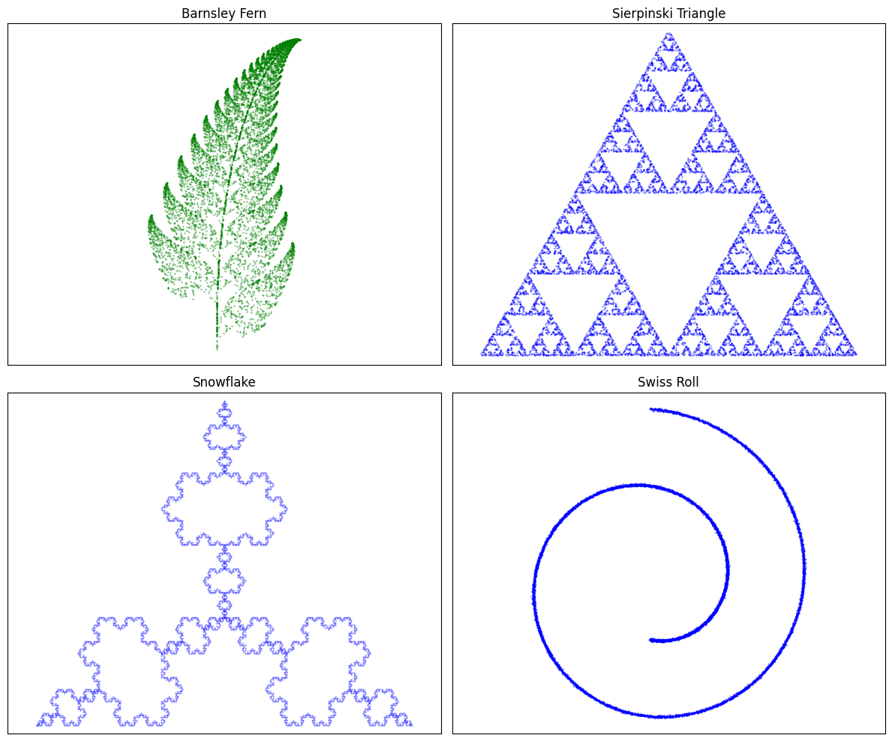

# Tiny Diffusion Model

This project provides a minimal and readable implementation of diffusion models applied to simple two-dimensional datasets.

The goal is to understand the core logic behind score-based diffusion models: how they add noise to data over time, and how a neural network can learn to reverse this process to generate new samples.

No optimizations, tricks, or production-level code are included. The idea is to focus on clarity and learning.

---

## Datasets

The model is trained on small 2D datasets, including fractals and simple geometric structures. These datasets make it easier to visualize and interpret the training and sampling process.

Example datasets:

- Barnsley Fern
- Sierpinski Triangle
- Koch Snowflake
- Swiss Roll

Here is a sample of the datasets used:

<p align="center">
  
</p>

---

## Project Structure

```
tiny_diffusion_model/
├── tiny_diffusion_model/        # Core model and training code
│   ├── model.py
│   ├── diff.py
│   ├── gen_datasets.py
│   └── __init__.py
├── example/
│   └── training_example.ipynb   # Example notebook to train and sample
├── requirements.txt
├── setup.py
├── README.md
└── test_dataset.png
```

---

## Installation

To install the project locally:

```bash
git clone https://github.com/PedroBritodSa/tiny_diffusion_model.git
cd tiny_diffusion_model
pip install -e .
```

Then install the dependencies:

```bash
pip install -r requirements.txt
```

---

## Usage

You can run the training and sampling process by opening the notebook:

```
example/training_example.ipynb
```

It shows how to train the model and generate new samples from noise.

---

## Why This Exists

This project shows how diffusion models work by using small datasets and simple code. It's made for personal learning, not for speed or performance.

The code is based on a more complete open-source project: https://github.com/yuanchenyang/smalldiffusion.
If you want to explore the topic further, that repository is a good place to look.

---

## License

MIT License.
